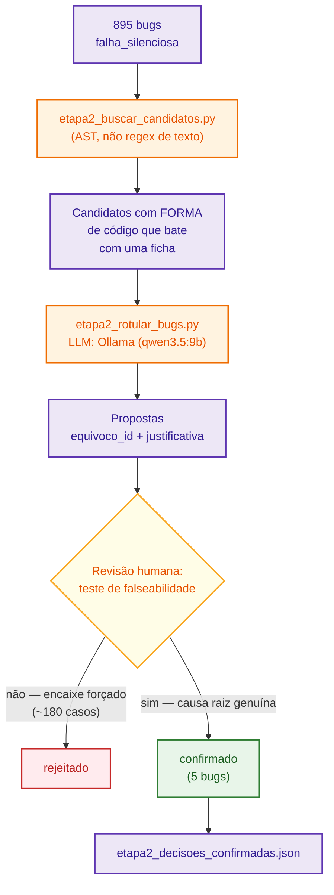
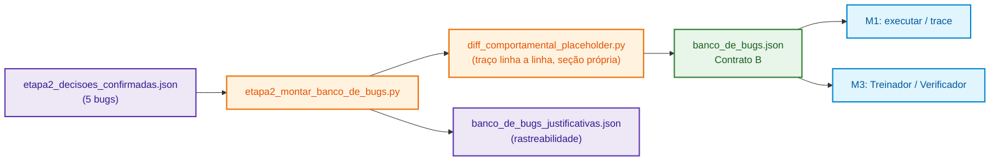
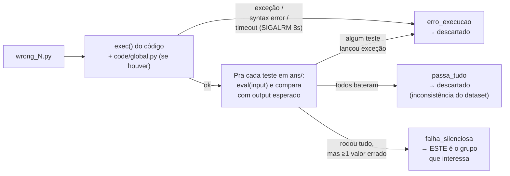
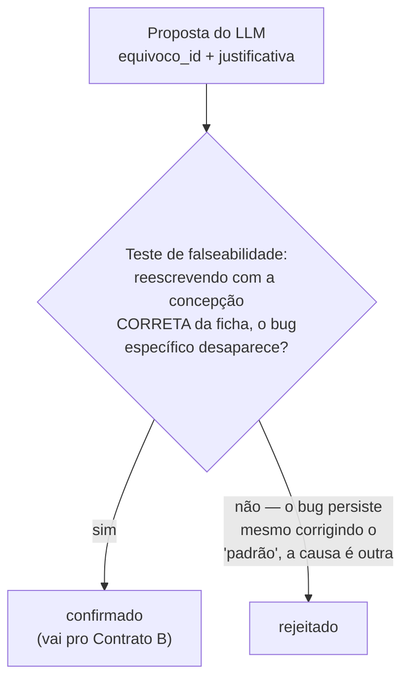
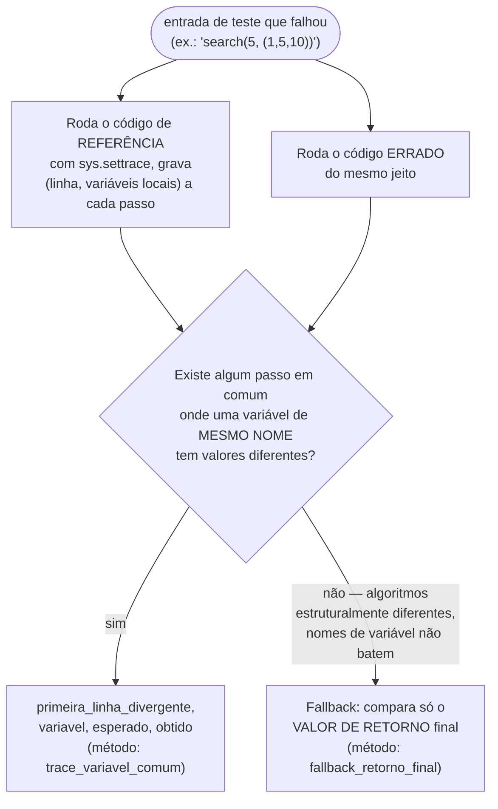
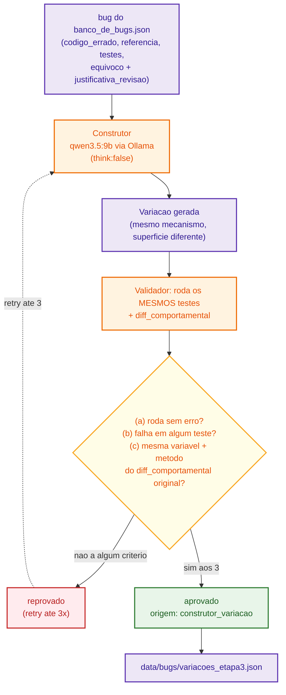

# Projeto Arandu

**Arandu** é um treinador de depuração autônomo para o AKCIT Camp 2026: o
aluno recebe um programa curto com um bug realista, investiga (roda
entradas, vê variáveis passo a passo), conserta e explica o erro. Um agente
de IA observa a investigação, mantém um modelo do aluno e decide a próxima
intervenção — sempre ancorada em execução real, nunca em suposição.

O projeto é dividido em 4 módulos:

- **M1** — motor de execução + ferramentas (MCP): `executar`, `trace`,
  `rodar_suite`, `diff_comportamental`, `gerar_entrada_discriminante`.
- **M2** — Fase A (offline, roda uma vez): ingestão de dados → rotulagem de
  equívocos → geração/validação de variações de bugs → mineração de
  trajetórias.
- **M3** — Fase B (runtime): o Treinador, o modelo do aluno, o Verificador
  (guardrail).
- **M4** — interface, métricas, pitch.

## Como rodar

Hoje só o **M2** tem pipeline executável de ponta a ponta — M1, M3 e M4
ainda estão em desenvolvimento (ver seções próprias abaixo). Pra rodar o M2:

```bash
git clone https://github.com/luiggyAlves/Arandu.git
cd Arandu/Mod2
pip install requests beautifulsoup4

# Etapas 2 e 3 usam um LLM local via Ollama por padrão (sem custo de API) —
# ver seção "M2 — Configuração do LLM" abaixo pra alternativas
ollama pull qwen3.5:9b

python scrape_progmiscon.py            # catálogo de equívocos
python etapa1_classificar_bugs.py      # classifica os bugs do Refactory
python etapa2_buscar_candidatos.py --por-padrao 20 --out data/bugs/etapa2_candidatos.json
python etapa2_rotular_bugs.py --candidatos data/bugs/etapa2_candidatos.json
# -> revise manualmente as propostas em data/bugs/etapa2_decisoes_confirmadas.json
python etapa2_montar_banco_de_bugs.py  # monta o Contrato B final
python etapa3_construtor_validador.py  # laço Construtor->Validador ao vivo
python etapa4_minerar_trajetorias.py   # monta a Loja de Trajetórias
```

O passo a passo completo, com o porquê de cada etapa e os fluxogramas, está
na seção **M2** abaixo.

---

## M1 — Motor de Execução

*(ainda não implementado)*

Camada de execução + ferramentas MCP que o Treinador (M3) usa pra investigar
o código do aluno sempre ancorado em execução real:

- `executar` — roda um programa com uma entrada e devolve o resultado.
- `trace` — executa passo a passo, expondo o estado das variáveis a cada
  linha (o [`diff_comportamental_placeholder.py`](Mod2/diff_comportamental_placeholder.py)
  do M2 é uma versão simplificada e isolada disso, a ser substituída por
  esta ferramenta oficial quando existir).
- `rodar_suite` — roda um programa contra uma bateria de testes (o M2 tem
  duas versões provisórias e isoladas disso — a checagem `exec`+`eval` do
  [`etapa1_classificar_bugs.py`](Mod2/etapa1_classificar_bugs.py) e a do
  Validador em [`etapa3_construtor_validador.py`](Mod2/etapa3_construtor_validador.py)
  — pra não esperar o M1 ficar pronto).
- `diff_comportamental` — compara a execução de dois programas (o certo e o
  com bug) e aponta onde e como elas divergem.
- `gerar_entrada_discriminante` — gera uma entrada de teste que expõe a
  diferença de comportamento entre duas implementações.

Isolamento/sandbox de verdade (código arbitrário em runtime, não um dataset
acadêmico já inspecionado) é responsabilidade deste módulo.

> ⚠️ **Todo placeholder acima é provisório.** Quando o M1 de verdade
> existir, as três peças provisórias citadas (`diff_comportamental_placeholder.py`
> e os dois executores de teste do M2) devem ser trocadas pelas ferramentas
> oficiais — elas existem só pra M2/Etapa 3 não travar esperando o M1.

---

## M2 — Banco de Bugs

Este README documenta o que foi feito nas **Etapas 1, 2, 3 e 4** do M2 (Fase
A, offline) do Projeto Arandu: sair do dataset bruto do Refactory até um
banco curado de bugs rotulados com o catálogo de equívocos do ProgMiscon,
uma fatia ao vivo do laço Construtor→Validador (Etapa 3) provando o
guardrail funcionando, e uma Loja de Trajetórias (Etapa 4) — tudo pronto
pra o M1 (rodar) e o M3 (consumir no Treinador).

> Escopo: Etapas 1, 2, 3 (fatia ao vivo simplificada — Construtor→Validador
> sobre o MESMO problema/testes do bug original, sem gerar problema novo) e
> 4 (mineração de trajetórias, sem LLM). A calibração de dificuldade
> (Etapa 5) fica de fora.

### Visão geral do pipeline

Três diagramas, do mais geral pro mais detalhado — cada um cabe numa tela só.
Cores consistentes nos três: 🔵 azul = fonte/consumidor externo, 🟠 laranja =
script que processa, 🟣 roxo = arquivo gerado, 🟡 amarelo = decisão humana,
🔴 vermelho = rejeitado, 🟢 verde = confirmado/resultado final.

**1. Visão geral (das duas entradas até a Loja de Trajetórias):**

```mermaid
flowchart LR
    classDef fonte fill:#e1f5fe,stroke:#0288d1,stroke-width:2px,color:#01579b
    classDef processo fill:#fff3e0,stroke:#ef6c00,stroke-width:2px,color:#e65100
    classDef artefato fill:#ede7f6,stroke:#5e35b1,stroke-width:2px,color:#311b92
    classDef final fill:#e8f5e9,stroke:#2e7d32,stroke-width:2px,color:#1b5e20

    A["ProgMiscon\n(scrape_progmiscon.py)"]:::fonte --> B["Catálogo\n30 fichas"]:::artefato
    C["Refactory\n(data.zip)"]:::fonte --> D["1.783 bugs\nwrong/*.py"]:::artefato

    D --> E["Etapa 1\nclassificar"]:::processo
    E --> F["895 falha_silenciosa\n(diagrama da Etapa 1 ↓)"]:::artefato

    F --> G["Etapa 2\nbuscar + rotular"]:::processo
    B --> G
    G --> H["5 bugs confirmados\n(diagrama 2 abaixo)"]:::artefato

    H --> I["Contrato B\nbanco_de_bugs.json\n(diagrama 3 abaixo)"]:::final

    I --> K["Etapa 3\nConstrutor + Validador\n(ver seção própria)"]:::processo
    K --> L["variações aprovadas\nvariacoes_etapa3.json"]:::artefato

    I --> M["Etapa 4\nminerar trajetórias\n(sem LLM)"]:::processo
    L --> M
    M --> N["Loja de Trajetórias\nloja_trajetorias.json"]:::final

    I --> J["M1 / M3"]:::processo
    N --> J
```



**2. Etapa 2 em detalhe (busca de candidatos → LLM → revisão humana):**



**3. Do confirmado ao Contrato B:**



### Arquivos deste diretório

| Arquivo | O que faz | Saída |
|---|---|---|
| [scrape_progmiscon.py](Mod2/scrape_progmiscon.py) | Baixa e faz parsing das ~30 fichas do ProgMiscon (Python) | [out/progmiscon_python.json](Mod2/out/progmiscon_python.json), `out/raw/*.txt` |
| [etapa1_classificar_bugs.py](Mod2/etapa1_classificar_bugs.py) | Roda cada `wrong/*.py` do Refactory contra os testes de `ans/`, classifica em 3 grupos | [data/bugs/classificacao_etapa1.json](Mod2/data/bugs/classificacao_etapa1.json), [data/bugs/etapa1_detalhado.json](Mod2/data/bugs/etapa1_detalhado.json) |
| [etapa2_buscar_candidatos.py](Mod2/etapa2_buscar_candidatos.py) | Encontra, via **AST** (não regex de texto), bugs cuja forma de código bate com um equívoco do catálogo | `data/bugs/etapa2_candidatos*.json` |
| [etapa2_rotular_bugs.py](Mod2/etapa2_rotular_bugs.py) | Manda cada candidato pra um LLM (Ollama por padrão, Claude opcional) com o catálogo completo, pede rótulo + justificativa | `data/bugs/etapa2_propostas_llm*.json` (sempre `revisao_pendente: true`) |
| [etapa2_decisoes_confirmadas.json](Mod2/data/bugs/etapa2_decisoes_confirmadas.json) | Resultado da **revisão humana** das propostas (só o que passou no teste de falseabilidade) | — (é o insumo do próximo passo) |
| [etapa2_montar_banco_de_bugs.py](Mod2/etapa2_montar_banco_de_bugs.py) | Monta o Contrato B a partir das decisões confirmadas | [data/bugs/banco_de_bugs.json](Mod2/data/bugs/banco_de_bugs.json), `data/bugs/banco_de_bugs_justificativas.json` |
| [diff_comportamental_placeholder.py](Mod2/diff_comportamental_placeholder.py) | **Placeholder** da ferramenta oficial do M1 — compara execução do código certo vs errado | usado por `etapa2_montar_banco_de_bugs.py` e `etapa3_construtor_validador.py` |
| [etapa3_construtor_validador.py](Mod2/etapa3_construtor_validador.py) | Laço Construtor (gera variação via LLM) → Validador (aprova/reprova por execução real) | [data/bugs/variacoes_etapa3.json](Mod2/data/bugs/variacoes_etapa3.json) |
| [etapa4_minerar_trajetorias.py](Mod2/etapa4_minerar_trajetorias.py) | Junta bugs reais + variações aprovadas num registro de trajetória cada (diff textual + assinatura comportamental copiada) — sem LLM | [data/bugs/loja_trajetorias.json](Mod2/data/bugs/loja_trajetorias.json) |

### Configuração do LLM (Etapas 2 e 3)

`etapa2_rotular_bugs.py` suporta dois backends, via `--backend`:

- **`ollama` (padrão, sem custo de API)** — roda um modelo local. Só
  precisa do [Ollama](https://ollama.com) instalado e do servidor de pé:
  ```bash
  ollama serve                # se ainda não estiver rodando
  ollama pull qwen3.5:9b      # modelo padrão do script
  ```
  Pra usar outro modelo local: `--modelo <nome> --ollama-url http://host:porta`.

- **`anthropic`** — API da Anthropic (Claude), custo por chamada. Precisa
  de uma chave, que **não** vai commitada no repositório (está no
  `.gitignore`):
  ```bash
  cd Mod2
  echo "CLAUDE_KEY=sua-chave-aqui" > .env
  ```
  Troque `sua-chave-aqui` pela sua chave (formato `sk-ant-api03-...`,
  disponível em https://console.anthropic.com/) — o script também aceita
  `ANTHROPIC_API_KEY` no ambiente, se preferir não usar arquivo `.env`. Use
  com `python etapa2_rotular_bugs.py --backend anthropic --candidatos ...`.

`etapa3_construtor_validador.py` (Construtor) usa **só Ollama**, sempre —
sem `--backend` (decisão já tomada pra essa etapa, ver seção Etapa 3 pra
justificativa). Pra trocar de modelo, edite a constante `MODELO_CONSTRUTOR`
no topo do arquivo (não tem flag de linha de comando pra isso).

### Como reproduzir do zero

```bash
pip install requests beautifulsoup4

## 1. Catálogo de equívocos (ProgMiscon)
python scrape_progmiscon.py
## -> confira: "Encontradas N fichas." deve ser ~30. Abra 3-5 out/raw/*.txt
##    e compare com out/progmiscon_python.json antes de seguir.

## 2. Extrair o dataset Refactory (já está em data/ neste repo; se precisar de novo)
unzip data.zip

## 3. Etapa 1 — classificar todos os wrong/*.py
python etapa1_classificar_bugs.py

## 4. Etapa 2 — achar candidatos por forma de código (AST) e propor rótulos via LLM
python etapa2_buscar_candidatos.py --por-padrao 20 --out data/bugs/etapa2_candidatos.json
python etapa2_rotular_bugs.py --candidatos data/bugs/etapa2_candidatos.json

## 5. Revisar manualmente as propostas (ver seção "Etapa 2" abaixo) e escrever/editar
##    data/bugs/etapa2_decisoes_confirmadas.json com decisao_humana: "confirmado"

## 6. Montar o Contrato B a partir das decisões confirmadas
python etapa2_montar_banco_de_bugs.py

## 7. Etapa 3 — laço Construtor -> Validador ao vivo (2-3 bugs por padrão)
ollama pull qwen3.5:9b   # se ainda não tiver
python etapa3_construtor_validador.py

## 8. Etapa 4 — mineração de trajetórias (Fonte A do RAG, sem LLM)
python etapa4_minerar_trajetorias.py
```

---

### Etapa 1 — Ingestão e seleção

**Objetivo:** separar, dos 1.783 programas com bug do Refactory, só os que
"rodam, não travam, e falham silenciosamente" — o único tipo de bug que
justifica um agente investigativo (bug que trava já tem assinatura
determinística, não precisa de IA pra achar).



Como cada exercício do Refactory é uma função pura (ex.: `search(x, seq)`) e
cada `ans/input_NNN.txt` já é uma chamada Python pronta (ex.:
`search(42, (-5, 1, 3, 5, 7, 10))`), "rodar o programa" aqui é: `exec()` do
código do aluno, `eval()` de cada input nesse namespace, e comparar o valor
obtido com `ast.literal_eval(output_NNN.txt)`.

**Isolamento:** cada arquivo roda dentro de um worker de
`multiprocessing.Pool`, com stdout/stderr redirecionados e um alarme
(`signal.SIGALRM`, 8s) que interrompe a execução se ela travar — existem
casos reais de `while True` no dataset. Uma inspeção prévia (grep) não achou
nenhum uso de `os`/`subprocess`/`socket`/`open`/`exit`/`input` em
`wrong/*.py`, então isso foi considerado seguro pra esse dataset acadêmico
específico — **não é o sandbox de runtime do M1**, que vai lidar com código
arbitrário e precisa de isolamento de verdade.

#### Resultado (1.783 arquivos, ~32s)

| Questão | Total | erro_execucao | **falha_silenciosa** | passa_tudo |
|---|---:|---:|---:|---:|
| question_1 (Sequential Search) | 575 | 279 | **296** | 0 |
| question_2 (Unique dates/months) | 435 | 139 | **296** | 0 |
| question_3 (Duplicate elimination) | 308 | 193 | **111** | 4 |
| question_4 (Sorting tuples) | 357 | 151 | **147** | 59 |
| question_5 (Top-K) | 108 | 63 | **45** | 0 |
| **Total** | **1.783** | **825** | **895** | **63** |

Nenhuma questão ficou com poucos candidatos — o risco descrito no plano do
M2 ("poucos bugs em falha_silenciosa") não se confirmou.

---

### Etapa 2 — Rotulagem com o catálogo ProgMiscon

**Objetivo original:** 5–10 bugs rotulados. **O que aconteceu na prática:**
a primeira amostra aleatória (20 candidatos de question_1/2) rendeu quase
nenhum match real — isso disparou o critério de parada da seção 9 do
documento da tarefa ("menos de 5 com equívoco claro após revisar 15-20") e
o processo de busca foi revisado com o usuário em 3 rodadas.

#### Por que uma amostra aleatória não funciona bem aqui

O catálogo do ProgMiscon é sobre **mal-entendidos de sintaxe/semântica da
linguagem** (`=` vs `==`, `self`, `__init__`, encadeamento de atributos,
parênteses, curto-circuito, comparar com `True`/`False`, etc.). Os bugs
"falha_silenciosa" do Refactory, por outro lado, são majoritariamente
**erros de lógica algorítmica genéricos** (operador de comparação trocado,
direção errada, caso de borda esquecido, retorno prematuro num loop) — que
não têm ficha correspondente no catálogo. As duas coisas se sobrepõem menos
do que se esperava.

**Importante: o catálogo NÃO é focado em booleano** — essa é só a fatia dele
que deu match neste dataset específico. Das 30 fichas, só 7 são sobre
condicional/booleano; as outras 23 são de temas que os 5 exercícios do
Refactory usados aqui simplesmente não têm onde manifestar (nenhum deles usa
classes, por exemplo):

| Tema | Fichas | Por que não apareceu aqui |
|---|---|---|
| Atribuição / objetos / referências | `AssignCompares`, `AssignmentCopiesObject`, `VariablesHoldObjects`, `VariablesHoldExpressions`, `ObjectsMustBeNamed`, `SelfAssignable` | Testadas (via AST e LLM) e rejeitadas quando propostas — nenhum bug real de atribuição/aliasing nos 5 exercícios |
| OOP (`self`, `__init__`) | `InitCreates`, `InitReturnsObject`, `NoEmptyInit`, `SelfNoExpression` | **Nenhum dos 5 exercícios usa classes** — estruturalmente impossível de aparecer |
| Encadeamento de chamadas/atributos | `CannotChainAttributeAccesses`, `CannotChainAttributeToObjectInstantiation`, `RightToLeftChaining`, `OutsideInFunctionNesting` | Código dos exercícios não encadeia chamadas desse jeito; 1 proposta (`OutsideInFunctionNesting`) foi rejeitada por não ser causal |
| Sintaxe/parsing geral | `NoReservedWords`, `NoAtomicExpression`, `ParenthesesOnlyIfArgument`, `StringLiteralNoObject` | `NoReservedWords`/`NoAtomicExpression` são estruturalmente impossíveis aqui (ver tabela de detectores abaixo); `ParenthesesOnlyIfArgument` **é** um dos 2 tipos confirmados |
| Semântica de `return` | `DeferredReturn`, `ReturnCall`, `ReturnUnwindsMultipleFrames`, `MultipleValuesReturn`, `RecursiveFunctionNeedsIfElse` | Todas testadas e rejeitadas — o padrão mais comum no dataset ("`return` cedo demais dentro de loop") não é nenhuma dessas |
| Booleano/condicional | `ComparisonWithBoolLiteral`, `MapToBooleanWithIf`, `MapToBooleanWithTernaryOperator`, `IfIsLoop`, `ConditionalIsSequence`, `NoShortCircuit`, `NoSingleLogicAnd` | **2 das 7 confirmadas** (`ComparisonWithBoolLiteral`, `MapToBooleanWithIf`) — só nas 3 funções booleanas de `question_2` |

Ou seja: o gargalo não é o catálogo ser limitado — é este dataset específico
(5 exercícios funcionais simples, sem OOP, quase todos retornando
listas/índices em vez de booleano) ter pouca superfície de contato com a
maior parte das 30 fichas. Um exercício do Refactory que usasse classes
provavelmente destravaria as fichas de OOP.

#### Método final: AST em vez de amostra aleatória, + teste de falseabilidade

Em vez de amostrar arquivos ao acaso, [etapa2_buscar_candidatos.py](Mod2/etapa2_buscar_candidatos.py)
procura pela **forma sintática** de um equívoco usando o `ast` do Python
(muito mais preciso que regex de texto), em TODOS os 895 bugs
`falha_silenciosa`, nas 5 questões:

| Padrão detectado (AST) | Candidato a | Achados |
|---|---|---|
| `if/elif` de 3+ ramos misturando `True`/`False` com outro tipo (string, `None`) | `MapToBooleanWithIf` | 3 (só question_2) |
| Nome de função local usado sem `()` (comparado, negado, etc.) | `ParenthesesOnlyIfArgument` | 12 (só question_2) |
| `== True` / `== False` / `!= True` / `!= False` | `ComparisonWithBoolLiteral` | 41 (40 em question_2, 1 em question_1) |
| `and`/`or` com chamada de método com efeito colateral no lado direito | `NoShortCircuit` | 5 (nenhum sobreviveu à revisão) |
| uso do operador `&` | `NoSingleLogicAnd` | **0 em todo o dataset** |
| palavra reservada como identificador | `NoReservedWords` | impossível (vira `SyntaxError`, já cai em `erro_execucao`) |
| expressão atômica isolada | `NoAtomicExpression` | impossível (qualquer alternativa é semanticamente equivalente ou também vira erro) |
| `if/else` de 2 ramos só, mapeando bool | `MapToBooleanWithIf` (fraco) | 108 — quase todos rejeitados (ver abaixo) |

Cada candidato foi mandado pra um LLM (`etapa2_rotular_bugs.py`, **Claude
Haiku** — trocado de Sonnet 5 a pedido do usuário por custo de API) junto
com: código errado, código de referência, diff, testes que falharam, e as
30 fichas do catálogo (nome + crença incorreta + concepção correta). O
prompt inclui um **teste de falseabilidade obrigatório**: *"se eu reescrever
este trecho já usando a concepção CORRETA da ficha, o bug some?"* — mas na
prática o modelo (principalmente Haiku) ainda forçou muitos encaixes mesmo
com essa instrução, então **toda proposta foi reconferida manualmente**
aplicando esse mesmo teste "de verdade" antes de confirmar.



**Exemplo de rejeição:** `if count > 1: return False else: return True`
(trata contagem 0 como "único"). Reescrevendo com a concepção correta de
`MapToBooleanWithIf` (`return CONDITION` direto) dá `return not(count>1)` —
que é `count<=1`, e o bug (contagem 0 tratada como único) **continua
idêntico**. Ou seja, o if/else não é a causa; a causa é o operador de
comparação errado, algo sem ficha no catálogo. Esse padrão de rejeição se
repetiu ~90 vezes (a maior parte do volume revisado).

**Exemplo de confirmação:** `if len(tup)==1: return True elif len(tup)>1:
return False elif len(tup)==0: return None`. Reescrevendo com a concepção
correta (`return len(tup)==1`) o caso `len(tup)==0` passa a cair
corretamente em `False` — o bug **desaparece**. Aqui o padrão se mostra
como a causa raiz de verdade.

#### Tentativas malsucedidas (documentadas por transparência)

- **`DeferredReturn`** foi proposto 43 vezes pelo LLM — em **100% dos casos
  checados manualmente**, o bug real era "`return` acontece cedo demais
  dentro de um loop" (o oposto do que a ficha descreve: código *depois* de
  um `return` que o aluno acha que ainda vai rodar). Todas rejeitadas.
- **`AssignmentCopiesObject`**, **`AssignCompares`**, **`ConditionalIsSequence`**,
  **`OutsideInFunctionNesting`**, **`IfIsLoop`**, **`MultipleValuesReturn`**:
  cada uma apareceu 1-2 vezes, sempre como encaixe forçado (ex.:
  `AssignCompares` foi proposto pra um bug que era só um nome de variável
  digitado errado — não tinha nenhum `=`/`==` confundido no código).
- Busca dedicada por `NoShortCircuit`/`NoSingleLogicAnd`/`NoReservedWords`/
  `NoAtomicExpression` nas 5 questões inteiras: **zero candidatos
  sobreviventes**, com razão estrutural clara em cada caso (ver tabela
  acima) — não é falta de tentar, o dataset (exercícios funcionais simples
  de busca/dedup/ordenação) não tem onde esses equívocos se manifestariam
  sem virar erro de sintaxe/execução primeiro.
- `question_3` (dedup), `question_4` (sort) e `question_5` (top-k) **não
  renderam nenhum candidato pros 3 equívocos que funcionaram** —
  estruturalmente, essas questões retornam **listas**, não booleanos, e os
  3 equívocos confirmados (`MapToBooleanWithIf`, `ComparisonWithBoolLiteral`,
  `ParenthesesOnlyIfArgument`) só se manifestam em código que decide um
  `True`/`False`. Só `question_2` (3 funções booleanas) tem esse formato.

No total, **~184 candidatos** passaram pelo LLM entre as várias rodadas,
mais um census exaustivo via AST puro (sem LLM) pros 4 padrões acima — e
só **5 bugs sobreviveram** ao teste de falseabilidade manual.

#### Decisão final (com o usuário)

Dado que a busca foi exaustiva (todas as 5 questões, múltiplos detectores
AST, e o teto de candidatos plausíveis foi comprovadamente esgotado), a
decisão foi **fechar com os 5 bugs confirmados**, em vez de forçar mais
matches fracos ou usar extensão local (o usuário pediu explicitamente pra
não usar extensão local nesta rodada — só rótulos do catálogo ProgMiscon).
Isso bate o **mínimo de 5** do documento da tarefa, mas no limite inferior
do range 5–10 sugerido.

#### Os 5 bugs confirmados

| bug_id | Questão | Equívoco | Por quê (resumo) |
|---|---|---|---|
| `refactory_q1_567` | question_1 | `ComparisonWithBoolLiteral` | `if seq == False:` pra checar sequência vazia — nunca é verdadeiro; deveria ser `if not seq:` |
| `refactory_q2_021` | question_2 | `MapToBooleanWithIf` | if/elif de 3 ramos pra mapear contagem→bool; ramo de contagem 0 retorna uma string em vez de `False` |
| `refactory_q2_039` | question_2 | `MapToBooleanWithIf` | mesmo padrão, ramo de contagem 0 retorna `None` em vez de `False` |
| `refactory_q2_107` | question_2 | `ParenthesesOnlyIfArgument` | `if count_dates == 1:` compara a FUNÇÃO com 1, sem chamar `count_dates(...)` |
| `refactory_q2_258` | question_2 | `ParenthesesOnlyIfArgument` | `if not unique_day and not unique_month:` nega as funções sem chamá-las |

Justificativa completa de cada um em
[data/bugs/etapa2_decisoes_confirmadas.json](Mod2/data/bugs/etapa2_decisoes_confirmadas.json)
e [data/bugs/banco_de_bugs_justificativas.json](Mod2/data/bugs/banco_de_bugs_justificativas.json).

---

### `diff_comportamental` — placeholder do M1

O Contrato B pede um campo `diff_comportamental`. A ferramenta oficial é do
M1 e ainda não existe, então [diff_comportamental_placeholder.py](Mod2/diff_comportamental_placeholder.py)
implementa uma versão simples e isolada — **substituir pela ferramenta
oficial assim que ela existir.**



Limitações conhecidas (aceitáveis num placeholder, documentadas no próprio
código): a comparação passo-a-passo é por ÍNDICE de execução (ingênua — se
os dois códigos têm granularidade de linha diferente, os passos podem
"desalinhar" e a comparação parar de fazer sentido); só casa variáveis de
mesmo nome; sem sandbox de verdade (adequado pra este dataset já inspecionado,
não pra código arbitrário em runtime). Na prática, os 5 bugs do banco final
caíram todos no fallback (algoritmos com nomes de variável muito diferentes
do de referência), o que ainda assim dá o essencial pro Contrato B: a
divergência real de valor esperado vs. obtido.

---

### Problemas técnicos encontrados e corrigidos no caminho

Por transparência, estes são bugs de implementação (não de metodologia) que
apareceram durante o desenvolvimento dos scripts e foram corrigidos antes do
resultado final:

1. **`scrape_progmiscon.py` tinha 5 bugs de parsing**, achados numa conferência
   manual anterior a este documento (comparando `out/raw/*.txt` com o JSON
   gerado, como o próprio script recomenda):
   - O botão de widget "Experience `<slug>` in Your Browser" vazava pro fim
     de `concepcao_correta` — o site renderiza esse botão em 3 linhas
     separadas, e o filtro original (regex de uma linha só) nunca batia.
   - A seção "Origin" (de onde vem o equívoco) vazava pro fim de
     `explicacao_correcao` — não tinha marcador próprio.
   - A seção "Related Misconceptions" vazava pro fim de `conceitos`.
   - `sintomas` virava uma lista de dezenas de fragmentos de um token só
     (ex.: `"if", "x", "=", "1", ":"`) em vez de texto corrido.
   - Quebras de linha no meio de frases (uma por trecho de código inline no
     HTML) em todos os campos de texto.
   Todos os 5 foram corrigidos direto no script (ver o comentário "Histórico
   de correções" no topo de [scrape_progmiscon.py](Mod2/scrape_progmiscon.py)), e
   o catálogo foi **baixado de novo do site** (não só reprocessado) pra
   confirmar o resultado antes de virar insumo da Etapa 2.

2. **`etapa2_rotular_bugs.py` — resposta vazia do LLM.** As primeiras
   chamadas ao Claude Sonnet 5 voltavam com conteúdo vazio em ~15% dos
   casos. Causa: o modelo usa "thinking" estendido por padrão nessa API, e
   com `max_tokens=500` o orçamento inteiro era consumido pelo bloco de
   pensamento (oculto), sem sobrar espaço pra escrever o JSON de resposta.
   Corrigido subindo `max_tokens` pra 1024 e pedindo explicitamente uma
   justificativa curta (≤40 palavras) no prompt. Também corrigido um erro de
   parsing de JSON com vírgula sobrando antes de `}`/`]` (comum o modelo
   gerar isso).

   **Atualização — backend trocado pra Ollama.** O script foi ajustado pra
   rodar um LLM local (`qwen3.5:9b` via Ollama) como padrão, sem custo de
   API — o backend Anthropic (Sonnet 5 → Haiku, usados nas rodadas
   documentadas acima) continua disponível via `--backend anthropic`. O
   mesmo problema de "thinking" consumindo a resposta apareceu de novo aqui
   (Qwen3 também "pensa" por padrão): corrigido passando `"think": false`
   na chamada à API do Ollama. **Atenção de qualidade:** num teste rápido
   com o `qwen3.5:9b`, ele não reconheceu um bug (`wrong_2_021.py`) que o
   Haiku tinha identificado corretamente como `MapToBooleanWithIf` — modelo
   local de 9B tende a ser mais fraco nesse tipo de julgamento semântico
   fino que o Haiku. Isso não afeta os 5 bugs já confirmados em
   `banco_de_bugs.json` (revisados manualmente), mas quem for rodar novas
   rotulagens com o Ollama deve revisar as propostas com ainda mais cuidado.

3. **`diff_comportamental_placeholder.py` — número de linha errado.** Na
   primeira versão, `codigo_globais` (o `code/global.py` da questão) era
   concatenado ANTES do código do aluno/referência antes de compilar, então
   `primeira_linha_divergente` contava a partir do topo do arquivo
   concatenado, não do arquivo `codigo_errado` isolado — um número de linha
   que não bate com o que quem lê `codigo_errado` no Contrato B vê. Corrigido
   executando `codigo_globais` à parte (sem rastreamento, antes) e só depois
   compilando `codigo_errado`/`codigo_referencia` sozinhos a partir da linha 1.

4. **`etapa3_construtor_validador.py` — resposta vazia do Construtor.**
   Mesma causa do item 2, de novo: com o `think` padrão (ligado) do Ollama,
   o `qwen3.5:9b` gastou os 3131 tokens de saída inteiros "pensando"
   (`done_reason: "length"`) e nunca escreveu o código — 9 de 9 tentativas
   com `codigo_errado` vazio na primeira rodada. Aqui não existe um
   `max_tokens` pra só aumentar, então a correção foi desligar o thinking
   (`think: false`) — depois disso, 4 tentativas, 3 aprovadas.

5. **Cópia solta de `banco_de_bugs.json` na raiz do repositório.** Durante o
   desenvolvimento da Etapa 3 apareceu um `banco_de_bugs.json` fora do
   `Mod2/` (conteúdo idêntico ao de dentro, provável resíduo de um comando
   de depuração rodado com o diretório de trabalho errado). Nunca foi
   commitado; removido antes do commit final — todo acesso ao banco de bugs
   fica só dentro de `Mod2/` (decisão explícita do usuário).

### Arquivos intermediários em `data/bugs/`

A Etapa 2 rodou em várias rodadas (amostra aleatória → busca AST ampliada →
busca nas 5 questões → padrões adicionais), cada uma gerando seu próprio par
de arquivos de candidatos/propostas. Eles ficaram todos no repositório por
rastreabilidade (dá pra ver exatamente o que foi tentado e rejeitado em cada
rodada), mas só dois arquivos importam pro resultado final:

- **`etapa2_decisoes_confirmadas.json`** — as decisões finais (o que entrou
  no banco).
- **`banco_de_bugs.json`** — o Contrato B em si.

Os demais (`etapa2_candidatos*.json`, `etapa2_propostas_llm*.json`) são o
histórico de cada rodada de busca — úteis pra auditoria ou pra quem quiser
entender por que um candidato específico foi rejeitado (procure pelo nome do
arquivo, ex. `wrong_2_048.py`, nos arquivos de propostas), mas não precisam
ser lidos pra usar o banco final.

### Checklist da Etapa 1/2 (seção 7 do documento da tarefa original)

- [x] `out/progmiscon_python.json` gerado e conferido manualmente (30 fichas, comparado com `out/raw/*.txt`)
- [x] `data/bugs/classificacao_etapa1.json` com contagem por questão e grupo
- [x] Bugs em `data/bugs/banco_de_bugs.json` no formato do Contrato B, com `equivoco_progmiscon` confirmado por revisão humana (não só proposto pelo LLM) — **5 bugs** (dentro do range 5-10, no limite inferior — ver seção Etapa 2 pra explicação)
- [x] Pelo menos 1 bug "roda, não trava, falha silenciosamente" — **todos os 5** vêm desse grupo
- [x] Diversidade: no máximo 2 bugs por `equivoco_progmiscon` — 2/2/1
- [x] Nenhum rótulo de extensão local usado nesta rodada (decisão explícita do usuário) — não se aplica o item "documentar critério de extensão local"

### Decisões que precisam de atenção de quem for usar este banco no M3

1. **Só 5 bugs, não 10**, e 4 dos 5 vêm da mesma questão (`question_2`) — o
   dataset Refactory, pelo menos nestas 5 questões, não tem volume de bugs
   que mapeiem "limpo" pro catálogo ProgMiscon além disso. Se o M3 precisar
   de mais volume, as opções são: (a) aceitar extensão local pros bugs de
   lógica algorítmica genérica (ver `data/bugs/etapa2_propostas_llm_full.json`
   pra ver os ~90 candidatos rejeitados — muitos são bugs reais, só não têm
   ficha no ProgMiscon), ou (b) rodar a Etapa 1/2 sobre outras linguagens/
   datasets do Refactory (ele cobre só Python aqui).
2. `diff_comportamental` é o placeholder descrito acima, não a ferramenta
   oficial do M1 — os campos existem e são úteis, mas a lógica de comparação
   é simplificada.
3. `dificuldade` continua `null` de propósito (Etapa 5, fora deste escopo).
   `aprovado_por_validador` nos 5 bugs originais também continua `null` —
   eles vieram direto da revisão humana da Etapa 2, não passaram pelo laço
   Construtor→Validador (isso só existe pras variações da Etapa 3, ver
   abaixo).

### Etapa 3 — Construtor → Validador (fatia ao vivo)

**Objetivo:** demonstrar o laço completo Construtor→Validador rodando de
verdade, não simulado — evidência concreta de guardrail (o sistema
consegue dizer "não" pra uma variação ruim, não só gerar). Escopo
deliberadamente simplificado: mesmo problema e mesmos testes do bug
original — só o Construtor gera uma **nova implementação com bug**, não um
problema novo (problema/testes novos ficam pra depois, fora deste
documento).



**Construtor** (`etapa3_construtor_validador.py`): monta um prompt com o
código de referência, o bug original (exemplo do padrão), a ficha do
ProgMiscon (crença incorreta + concepção correta) e a `justificativa_revisao`
da Etapa 2 (mecanismo raiz a preservar). Pede uma nova implementação com o
MESMO equívoco, nomes/forma diferentes, mesma assinatura de função. LLM:
`qwen3.5:9b` via Ollama, `think:false` — com thinking ligado, o modelo gasta
o orçamento de saída inteiro "pensando" e nunca chega a escrever o código
(`done_reason: length`, mesmo problema já documentado com o Claude Sonnet 5
na Etapa 2, só que aqui não existe um `max_tokens` pra só aumentar).

**Validador**: roda a variação contra os MESMOS testes do bug original e
aprova só se as 3 condições valerem: (a) roda sem travar/erro; (b) falha em
pelo menos um teste (não "consertou" o bug à toa); (c) o `diff_comportamental`
da variação tem a mesma `variavel` (`"retorno"`) e o mesmo `metodo`
(`"fallback_retorno_final"`) do bug original — falha da mesma forma
estrutural. Reaproveita `diff_comportamental_placeholder.py` sem alteração.
Até 3 tentativas por bug; toda tentativa (aprovada ou não) é gravada. Bugs
processados por padrão: `refactory_q2_021`, `refactory_q2_107`,
`refactory_q1_567` (um de cada equívoco do banco) — outros via
`--bugs bug_id1,bug_id2,...`.

**Resultado (3 bugs, 3 equívocos diferentes, 4 tentativas):**

| bug original | equívoco | tentativas | resultado |
|---|---|---|---|
| `refactory_q2_021` | `MapToBooleanWithIf` | 1 | ✅ aprovado na 1ª |
| `refactory_q2_107` | `ParenthesesOnlyIfArgument` | 1 | ✅ aprovado na 1ª |
| `refactory_q1_567` | `ComparisonWithBoolLiteral` | 2 | 1ª ❌ reprovada (consertou o bug sem querer), 2ª ✅ aprovada |

A tentativa reprovada é o exemplo mais claro do guardrail funcionando: o
Construtor gerou `if seq == False: return 0` (igual ao bug original) mas
completou o resto da função com a lógica de busca correta — o `if` virou
código morto inofensivo e a função passou em TODOS os testes. O Validador
pegou isso pelo critério (b) e reprovou, sem intervenção humana.

Saída completa em [data/bugs/variacoes_etapa3.json](Mod2/data/bugs/variacoes_etapa3.json)
(4 registros: 3 aprovados + 1 reprovado, cada um com o código gerado e a
evidência — `diff_comportamental` ou `motivo_reprovacao`).

> ⚠️ **Provisório, não é o M1/M3 de verdade.** A execução de testes e o
> `diff_comportamental` usados aqui são as mesmas peças provisórias da
> Etapa 2 (ver aviso na seção M1 acima e na seção M3 abaixo) — servem pra provar o laço
> Construtor→Validador funcionando na demo, e serão substituídas pelas
> ferramentas oficiais (`rodar_suite`, `diff_comportamental` do M1; o
> Validador de verdade do M3) assim que esses módulos existirem.

**Checklist da Etapa 3 (seção 6 do documento da tarefa):**

- [x] Pelo menos 2 bugs de equívocos diferentes processados pelo laço completo — **3 bugs, 3 equívocos diferentes**
- [x] `data/bugs/variacoes_etapa3.json` com veredito e evidência em cada tentativa
- [x] Pelo menos 1 variação aprovada de verdade — **3 aprovadas**
- [x] Log legível em português mostrando a decisão do Validador — console do próprio script (rode `python etapa3_construtor_validador.py` pra ver ao vivo)

### Etapa 4 — Mineração de trajetórias (Fonte A do RAG)

**Objetivo:** alimentar a Fonte A do RAG do M3 — material pra escolher o
próximo bug e fundamentar a dica na sub-rotina investigativa. **Não é
comportamento de aluno real** (isso só chega com uso real, Fonte B, fora do
MVP) — é derivado dos pares (errado, referência) do Refactory + variações
aprovadas do Construtor. Sem chamada de LLM: é join + reformatação sobre o
que as Etapas 1–3 já calcularam.

`etapa4_minerar_trajetorias.py` junta `banco_de_bugs.json` (5 bugs reais,
sempre existe) com `data/bugs/variacoes_etapa3.json` (só os itens com
`aprovado_por_validador: true` — reprovados não viram trajetória) e monta um
registro por item:

- `diff_textual` — `difflib.unified_diff(codigo_errado → codigo_referencia)`,
  nessa ordem (representa a mudança que **conserta** o bug).
- `assinatura_comportamental` — o `diff_comportamental` do item, **copiado
  direto, sem recalcular** (já validado nas Etapas 2/3).
- `dica_que_destravou` — sempre `null` no MVP (só existe com Fonte B).

**Resultado:** 8 trajetórias (5 de bugs reais + 3 das variações aprovadas da
Etapa 3), 3 equívocos distintos representados, nenhum `diff_textual` vazio —
salvo em [data/bugs/loja_trajetorias.json](Mod2/data/bugs/loja_trajetorias.json).
Verifiquei que as 8 `assinatura_comportamental` são idênticas (não só
parecidas) ao `diff_comportamental` de origem, byte a byte.

---

## M3 — Treinador (Fase B, runtime)

*(ainda não implementado)*

Consome o banco de bugs do M2 ([`Mod2/data/bugs/banco_de_bugs.json`](Mod2/data/bugs/banco_de_bugs.json))
e as ferramentas do M1 pra rodar a sessão de depuração com o aluno:

- **Treinador** — decide a próxima intervenção (pergunta, dica, entrada de
  teste sugerida) com base no que foi observado da investigação do aluno.
- **Modelo do aluno** — mantém o estado do que o aluno já tentou/entendeu ao
  longo da sessão.
- **Verificador (guardrail)** — audita as intervenções do Treinador antes de
  mostrá-las ao aluno, garantindo que fiquem ancoradas em execução real e
  não em suposição do LLM.

> ⚠️ **Fatia provisória já rodando no M2.** O laço Construtor→Validador (ver
> seção "M2 — Etapa 3" acima) é uma demonstração ao vivo simplificada desse
> guardrail — mesmo problema/testes do bug original, só uma nova
> implementação buggy. O Validador provisório de lá (critérios (a)/(b)/(c)
> em [`etapa3_construtor_validador.py`](Mod2/etapa3_construtor_validador.py))
> deve ser substituído pelo Verificador de verdade do M3 quando este módulo
> existir — a fatia do M2 não é o M3, só prova o mecanismo antes dele.

---

## M4 — Interface, métricas e pitch

*(ainda não implementado)*

Camada voltada pro usuário final e pra apresentação do projeto:

- Interface do treinador de depuração (o que o aluno efetivamente usa).
- Métricas de uso/aprendizado (o que medir pra saber se o treinador está
  ajudando de verdade).
- Material de pitch pro hackathon (26/09).
