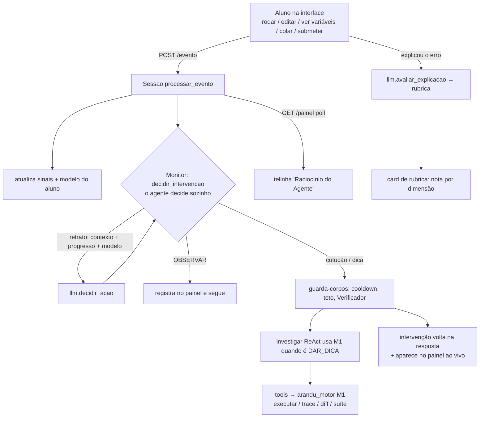

# Projeto Arandu 🪶 — Treinador de Depuração (Módulo 3)

**Um agente de IA que ensina depuração investigando o código do aluno em tempo
real — e decide sozinho quando e como intervir, como faria um bom tutor.**

> Arandu (tupi, "saber/conhecimento") não corrige o código por você. Ele observa
> como você depura, levanta hipóteses sobre o seu erro, projeta experimentos para
> testá-las na execução real, e só então decide — por conta própria — se vale um
> empurrão, e qual. Cada decisão aparece ao vivo numa tela de "raciocínio".

Projeto do **AKCIT Camp 2026** (Agentes de IA) — Trilha Norte / Manaus.
Este repositório é o **Módulo 3 (M3 — o Treinador)** integrado ao **M1** (motor
de execução) e aos dados do **M2** (banco de bugs).

---

## Índice
1. [O problema](#1-o-problema)
2. [A solução em uma olhada](#2-a-solução-em-uma-olhada)
3. [Como rodar](#3-como-rodar)
4. [Estrutura de pastas](#4-estrutura-de-pastas)
5. [O que cada arquivo faz](#5-o-que-cada-arquivo-faz)
6. [Fluxo de informação](#6-fluxo-de-informação)
7. [O agente: decisão autônoma + investigação](#7-o-agente)
8. [Modelo do aluno](#8-modelo-do-aluno)
9. [Verificador (guardrail)](#9-verificador)
10. [Datasets e fundamentação](#10-datasets-e-fundamentação)
11. [Limitações conhecidas](#11-limitações-conhecidas)

---

## 1. O problema

Ferramentas de correção automática dizem **que** um programa está errado, mas
param aí. Elas brilham no determinístico (sintaxe, exceção, teste que falha) e se
calam onde o programa **roda sem quebrar e mesmo assim está errado**: os erros de
**lógica** (condição invertida, filtro que faltou, `range` com um a menos,
comparação com `== False`). Pior: quando apontam a linha, ensinam a consertar
*aquele* bug — não a **depurar**.

Arandu ataca esse vão: ensina o **processo** de depuração no espaço dos erros de
lógica, usando a execução real como fonte de verdade.

---

## 2. A solução em uma olhada

- **Agente investigativo (ReAct):** levanta hipóteses concorrentes sobre o
  equívoco → projeta uma entrada que as separa → executa no M1 → poda → conclui.
- **Decisão autônoma de intervir:** a cada ação do aluno, o agente decide sozinho
  entre `OBSERVAR / ENCORAJAR / PERGUNTAR / SUGERIR_TESTE / MOSTRAR_VALORES /
  DAR_DICA / AVANCAR` — sem regra fixa. O código só impõe guarda-corpos de
  segurança (não vazar solução, não spammar).
- **Tela "Raciocínio do Agente":** transmite leitura → decisão → ação ao vivo.
- **Diálogo que fecha o laço:** quando o agente pergunta, o aluno responde e
  recebe feedback ancorado na tarefa (não é chat livre).
- **Rubrica transparente:** ao explicar o erro, o aluno recebe nota por dimensão
  (identificou / causa / correção) + comentário.
- **Modelo do aluno:** domínio por equívoco (BKT), habilidade de depuração,
  sinais de interface e qualidade da explicação — atualizado só com evidência
  limpa.
- **Verificador:** guardrail que barra dicas não ancoradas ou que vazariam a
  solução.

---

## 3. Como rodar

**Requisitos:** Python 3.10+ e o pacote `openai` (só para usar a chave real).

```bash
pip install -r requirements.txt
```

1. Deixe a pasta do M1 (`arandu-m1/`) ao lado dos arquivos do M3 (já está).
2. Crie um arquivo `.env` nesta pasta com a sua chave da OpenAI:
   ```
   OPENAI_API_KEY=sk-...
   # opcional: trocar o modelo (padrão gpt-4o). Ex.: gpt-4o-mini para economizar
   ARANDU_MODELO=gpt-4o
   ```
3. Rode o servidor:
   ```bash
   py servidor_web.py            # Windows
   # python3 servidor_web.py     # Linux/Mac
   ```
4. Abra **http://localhost:8002** no navegador.

**Confirmação de versão:** o boot imprime algo como
`... http://localhost:8002 (LLM: gpt-4o) [build 9 · ...]` e o topo da página
mostra o mesmo selo. Como o Python **não recarrega** arquivos editados, após
qualquer mudança em `.py` é preciso **Ctrl+C e rodar de novo** (o `.html` pede só
um Ctrl+F5 no navegador).

**Sem a chave:** o sistema cai no `MockLLM` (respostas roteirizadas) — a estrutura
roda de graça, mas a inteligência real é o modelo da OpenAI. Custo típico de uma
sessão com a chave: alguns centavos.

**Banco de bugs:** o padrão é o M2 (bugs reais do Refactory, estilo função). Para
os exemplos de stdin (digitar números): `ARANDU_BANCO=exemplos py servidor_web.py`.

---

## 4. Estrutura de pastas

```
arandu/
├── servidor_web.py      # ponto de entrada (servidor HTTP + escolha do LLM)
├── sessao.py            # orquestrador: máquina de estados + monitor agêntico
├── treinador.py         # o agente: investiga (ReAct) e decide intervir
├── modelo_aluno.py      # retrato do aluno (4 dimensões, BKT) + persistência
├── verificador.py       # guardrail (não vaza solução, exige âncora)
├── llm.py               # porta única do LLM (OpenAI) + MockLLM + prompts
├── catalogo.py          # catálogo de equívocos (inspirado no ProgMiscon)
├── tools.py             # adaptador M3 ↔ motor do M1 (executar/trace/diff/suíte)
├── banco_m2.py          # carrega o banco de bugs + variações do M2
├── config.py            # parâmetros e guarda-corpos (tetos, cooldown, níveis)
├── log.py               # logging (terminal + logs/arandu.log)
├── web/index.html       # interface (editor + telinha do agente + rubrica)
├── demo_*.py            # scripts de demonstração de cada módulo (opcionais)
├── requirements.txt     # dependências (openai)
├── README.md            # este arquivo
├── PONTOS-DE-ATENCAO.md # auditoria para a banca (forças, riscos, plano)
├── arandu-m1/           # M1 — motor de execução isolada (subprocesso/sandbox)
└── Arandu-m2/           # M2 — dados de bugs (só Mod2/data/bugs entra no repo)
```

Ignorados no Git (ver `.gitignore`): `.env`, `logs/`, `dados_alunos/`,
`__pycache__/`, `_to_delete/`, e o grosso do M2 (mantém-se só o banco de bugs).

---

## 5. O que cada arquivo faz

| Arquivo | Responsabilidade |
|---|---|
| **servidor_web.py** | Sobe um servidor HTTP (biblioteca padrão, multi-thread). Escolhe o LLM (OpenAI se houver chave, senão MockLLM). Serve a página e expõe `POST /evento`, `POST /iniciar`, `GET /modelo`, `GET /painel`, `GET /info`. |
| **sessao.py** | O "cérebro operacional". Máquina de estados (escolhendo bug → aluno trabalhando → aguardando explicação → encerrada). Recebe cada evento do aluno, aciona o **monitor agêntico**, aplica guarda-corpos, atualiza o modelo e alimenta a telinha. |
| **treinador.py** | O agente. `decidir_intervencao()` (decide a ação), `investigar()` (laço ReAct), `produzir_dica()`, `intervir()` (investiga + verifica). Define o baralho de ações (`ACOES`). |
| **modelo_aluno.py** | Dataclass do aluno nas 4 dimensões; atualização BKT; persistência em JSON por `id_aluno` (pseudônimo, sem dado pessoal). |
| **verificador.py** | Recebe uma mensagem (envelope) e aprova/barra: exige âncora de execução para dicas e bloqueia vazamento da solução. |
| **llm.py** | Interface única `chamar(tarefa, dados)`. `OpenAILLM` (gpt-4o, com timeout) e `MockLLM`. Contém todos os **prompts** (gerar_hipoteses, projetar_entrada, podar, redigir_dica, decidir_acao, avaliar_resposta, avaliar_explicacao). |
| **catalogo.py** | Dicionário de equívocos (nome, crença errada, texto de correção). |
| **tools.py** | Traduz as chamadas do M3 para o `arandu_motor` (M1) e converte os formatos de volta. |
| **banco_m2.py** | Lê `banco_de_bugs.json` + `variacoes_etapa3.json` do M2 e mapeia para o formato do M3; estima dificuldade (para ordenar do simples ao complexo). |
| **config.py** | Tetos do laço (passos, regenerações, rejeições), cooldown/teto de intervenções, níveis de dica, timeout de inatividade. |
| **web/index.html** | Editor de código, campo de entrada, botões, **telinha do agente** (poll de `/painel`), painel de sinais, e o card de **rubrica** com botão "próximo desafio". |
| **demo_*.py** | Demonstrações isoladas de cada peça (tools, sessão, treinador, M2) — úteis para a equipe entender cada módulo; não fazem parte do servidor. |

---

## 6. Fluxo de informação



**Eventos que a interface envia** (`POST /evento`, campo `tipo`):
`rodou_entrada`, `ver_trace`, `pediu_dica`, `submeteu_correcao`, `explicou`,
`respondeu_pergunta`, `sinais` (churn/pausas/colagem), `inativo`, `sair`.

Depois de `rodou_entrada`, `submeteu_correcao` (quando falha) e da colagem
externa, a Sessão chama o **monitor**: monta um *retrato* (o que acabou de
acontecer + progresso no bug + modelo do aluno) e pergunta ao agente o que fazer.
A decisão e a ação entram na resposta **e** no painel (`GET /painel`, que a
interface consulta a cada 2,5 s).

---

## 7. O agente

### 7.1 Decisão autônoma (o monitor)
A cada ação relevante, `sessao._monitorar()` monta o **retrato** e chama
`treinador.decidir_intervencao()`, que consulta o LLM (`decidir_acao`). O agente
escolhe **uma** ação do baralho `ACOES`. Princípios embutidos no prompt:
- OBSERVAR é o padrão; intervir de menos > intervir demais.
- Explorar entradas diferentes é saudável; achar a entrada que expõe o erro é
  vitória (encorajar, não "tente outra coisa").
- Estagnação real (repetir a mesma entrada, travar) → cutucão socrático.
- **Escalonamento:** se um cutucão não pegou, sobe de nível (sugerir → mostrar
  variáveis → dica).
- Colar código de fora → pedir que explique o que colou.

**Guarda-corpos** (em `sessao`/`config`, não decidem *quando* ajudar, só evitam
dano): cooldown entre intervenções, teto por sessão, e o Verificador.

### 7.2 Investigação (ReAct)
Quando decide dar uma dica, `treinador.investigar()` roda o ciclo:
`gerar_hipoteses → projetar_entrada (discriminante) → executar/analisar (M1) →
podar → concluir`, com regeneração e *fallback* direto como salvaguardas. Cada
passo aparece na telinha (🔬), tornando visível a parte antes escondida.

---

## 8. Modelo do aluno

Quatro dimensões (`modelo_aluno.py`), atualizadas **só com evidência limpa**:
1. **Domínio por equívoco** — probabilidade estilo **BKT**. Sobe apenas quando o
   aluno **demonstra** entendimento (rubrica da explicação boa), não por passar
   nos testes. Resolver colando + "não sei" **não** infla o domínio.
2. **Habilidade de depuração** — forma hipótese, testa entrada discriminante, lê
   variáveis, localiza antes de editar. (Ações do próprio agente — ex.: abrir as
   variáveis por ele — **não** creditam o aluno.)
3. **Sinais de interface** — execuções, entradas discriminantes rodadas sozinho
   (sinal-ouro), uso do trace, tempo até 1ª execução, churn, colagens, pausas.
4. **Qualidade da explicação** — nota geral da rubrica.

Persistência: um JSON por aluno em `dados_alunos/` (pseudônimo — LGPD).

---

## 9. Verificador

Toda mensagem passa por `verificar()` antes de chegar ao aluno. Ele barra:
- dicas **sem âncora** de execução (afirmou sem rodar);
- mensagens que **revelariam a solução** (trechos do código de referência, ou um
  bloco de código embutido que passa em todos os testes).

Cutucões socráticos (perguntas/encorajamento) dispensam a âncora, mas o bloqueio
de vazar solução continua valendo.

---

## 10. Datasets e fundamentação

- **ProgMiscon** — catálogo de equívocos de programação (base do `catalogo.py`).
- **Refactory** — pares (código com bug, código correto) de funções Python de
  iniciantes. Fonte dos bugs reais do M2 (estilo chamada de função).
- **CodeBench** — juiz online longitudinal (uso previsto na fase final).

O M2 também gera **variações**: a partir de um bug real + a tag do equívoco, cria
novos códigos que reproduzem o mesmo equívoco (só as aprovadas pelo validador
viram treino).

---

## 11. Limitações conhecidas

Ver **PONTOS-DE-ATENCAO.md** para a análise completa (forças, riscos que a banca
pode questionar e plano priorizado). Em resumo: o servidor de demo atende **um
aluno por vez** (estado global — proposital para a gravação); o comportamento do
agente é não-determinístico (mitigado por guarda-corpos + Verificador); e a
validação do modelo do aluno com dados reais é trabalho da fase final.

---

*Projeto Arandu — AKCIT Camp 2026 · Trilha Norte / Manaus.*
