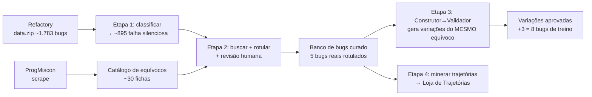
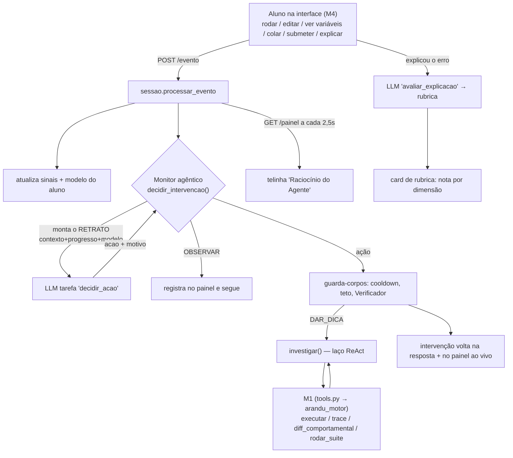

# Projeto Arandu 🪶

**Um treinador de depuração autônomo: o aluno recebe um programa curto com um
bug de lógica realista, investiga (roda entradas, vê variáveis passo a passo),
conserta e explica o erro. Um agente de IA observa a investigação, mantém um
modelo do aluno e decide sozinho a próxima intervenção — sempre ancorada em
execução real, nunca em suposição.**

Projeto do **AKCIT Camp 2026** (Agentes de IA) — Trilha Norte / Manaus.

> Arandu (tupi, "saber/conhecimento"). A ferramenta não corrige o código por
> você: ela ensina o **processo** de depuração no espaço onde as ferramentas
> comuns se calam — os erros de **lógica** (o programa roda sem quebrar e mesmo
> assim está errado).

---

## Índice
1. [O problema](#1-o-problema)
2. [A solução e os 4 módulos](#2-a-solução-e-os-4-módulos)
3. [O pipeline completo (Fase A offline → Fase B runtime)](#3-o-pipeline-completo)
4. [Fluxo de informação em runtime](#4-fluxo-de-informação-em-runtime)
5. [Exemplo prático (uma sessão real, passo a passo)](#5-exemplo-prático)
6. [Detalhe crucial: o que o agente "vê" para decidir (o retrato)](#6-o-retrato)
7. [Detalhe crucial: as tarefas de LLM (prompts)](#7-as-tarefas-de-llm)
8. [Modelo do aluno](#8-modelo-do-aluno)
9. [Verificador (guardrail)](#9-verificador)
10. [Como rodar](#10-como-rodar)
11. [Estrutura de pastas e o que cada arquivo faz](#11-estrutura-e-arquivos)
12. [Datasets, fundamentação e limitações](#12-datasets-e-limitações)

---

## 1. O problema

Ferramentas de correção automática (juízes online, linters, testes) dizem **que**
um programa está errado, mas param aí. Elas brilham no determinístico (sintaxe,
exceção, teste que falha) e se calam onde o programa **roda sem quebrar e mesmo
assim está errado**: os erros de **lógica** — condição invertida, filtro que
faltou, `range` com um a menos, comparar com `== False`. Pior: quando apontam a
linha, ensinam a consertar *aquele* bug, não a **depurar**.

Arandu ataca esse vão: ensina o **método investigativo** de depuração usando a
execução real como fonte de verdade.

---

## 2. A solução e os 4 módulos

O sistema é dividido em quatro módulos com contratos claros (a equipe trabalha em
paralelo). Este repositório é o **runtime do M3** integrado ao **M1** e aos
**dados do M2**.

| Módulo | Papel | Quando roda |
|---|---|---|
| **M1 — Motor de execução** | Roda o código do aluno com segurança (sandbox) e devolve fatos: `executar`, `trace`, `rodar_suite`, `diff_comportamental`. É a **fonte de verdade**. | Runtime |
| **M2 — Banco de bugs** | Pipeline **offline** (roda uma vez): do dataset bruto do Refactory até um banco curado de bugs rotulados (ProgMiscon), variações validadas e uma loja de trajetórias. | Offline (Fase A) |
| **M3 — Treinador** | O agente: decide se/quando/como intervir, investiga (ReAct), redige dicas; mantém o modelo do aluno; o Verificador (guardrail). | Runtime (Fase B) |
| **M4 — Interface/métricas/pitch** | A interface web do aluno e as métricas. *(Neste repo, a interface `web/index.html` já cumpre esse papel para a demo.)* | Runtime |

Ideia central em uma frase: **o agente decide como um tutor decidiria; as
ferramentas determinísticas do M1 produzem os fatos; o Verificador impede
vazamento da solução; e tudo é registrado ao vivo.**

---

## 3. O pipeline completo

### Fase A — M2 (offline, roda uma vez): construir o material didático



O que a Fase A entrega para o runtime (arquivos em `Arandu-m2/Mod2/data/bugs/`):
- **`banco_de_bugs.json`** — bugs reais do Refactory, rotulados com o equívoco do
  ProgMiscon, no formato do runtime (Contrato B).
- **`variacoes_etapa3.json`** — variações geradas que reproduzem o mesmo equívoco;
  só as **aprovadas pelo Validador** viram treino.
- **`loja_trajetorias.json`** — trajetórias de intervenção por equívoco (semente
  do RAG; ver limitações).

> A geração usa um LLM (por padrão local, via Ollama) e revisão humana no meio —
> é offline e não precisa rodar para usar a ferramenta. O runtime só **consome**
> os JSONs acima.

### Fase B — M3 (runtime): treinar o aluno

O aluno interage pela interface; cada ação vira um **evento** para o motor da
sessão (M3), que consulta o **agente** (decisão) e as **ferramentas** (M1), e
mantém o **modelo do aluno**. Detalhado na próxima seção.

---

## 4. Fluxo de informação em runtime



**Eventos que a interface envia** (`POST /evento`, campo `tipo`):
`rodou_entrada`, `ver_trace`, `pediu_dica`, `submeteu_correcao`, `explicou`,
`respondeu_pergunta`, `sinais` (churn/pausas/colagem), `inativo`, `sair`.

Depois de `rodou_entrada`, `submeteu_correcao` (quando falha) e da colagem de
código externo, a sessão chama o **monitor**: monta o **retrato** (seção 6) e
pergunta ao agente o que fazer. A decisão e a ação entram na resposta **e** no
painel. `ver_trace` (abrir variáveis) é ação boa do aluno — só observamos.

---

## 5. Exemplo prático

Uma sessão real com o bug `search(x, seq)` cujo equívoco é comparar com um
booleano (`if seq == False:` — equívoco *ComparisonWithBoolLiteral*):

1. **Aluno roda** `search(42, (-5,1,3,5,7,10))` → saída `6`.
   → 🧠 leitura: "1ª execução, explorando"; 🎯 **OBSERVAR**.
2. **Roda a mesma entrada de novo** → 🎯 **OBSERVAR** (ainda explorando).
3. **Roda a mesma pela 3ª vez** → 🧠 "repetiu sem tirar conclusão"; 🎯 **PERGUNTAR**:
   *"O que você espera que aconteça testando a mesma entrada de novo?"* — abre a
   caixa de resposta; o aluno responde e recebe **feedback ancorado**.
4. **Roda** `search(42, ())` (lista vazia) → saída `None`, **discriminante!**
   → 🎯 **ENCORAJAR**: *"Boa! Essa entrada expôs o problema."*
5. **Cola um código de fora** → 🎯 **PERGUNTAR**: *"Explique com suas palavras o
   que o código colado faz."* (colar um trecho do **próprio** exercício NÃO
   dispara isso.)
6. **Pede dica** → o agente **investiga** (ReAct), visível no painel:
   `🔬 3 hipóteses → 🔬 experimento: rodei search(5, []) → SEPAROU → 🔬 poda: sobra H1
   → 🔬 conclusão: CondicaoInvertida` → 💬 **dica ancorada** (sem entregar a resposta,
   barrada pelo Verificador se tentasse).
7. **Corrige e submete** → 11/11 testes passam → o sistema pede a explicação.
8. **Explica o erro** → aparece a **rubrica**: Identificou 100% · Causa 50% ·
   Correção 0% · Nota 50% + comentário. O aluno lê e clica em "próximo desafio".

Tudo isso aparece **ao vivo** na tela "Raciocínio do Agente" — é o que torna a
agência demonstrável.

---

## 6. O retrato

**Este é o detalhe mais importante da decisão agêntica.** A cada ação, o
orquestrador monta um "retrato" da situação (só **fatos**, não decide nada) e o
entrega ao agente. É exatamente isto que o agente "vê" para decidir
(`sessao._retrato()`):

**Do que acabou de acontecer (`evento_atual`):**
- `tipo` do evento (rodou_entrada, submeteu_correcao, colou_codigo_externo…)
- `entrada` rodada e `saida` obtida
- `entrada_expoe_o_erro` — essa entrada é **discriminante** (revela o bug)? *(vem do M1)*
- `e_repeticao_da_anterior` — repetiu a mesma entrada?

**Do progresso no bug atual (`progresso`):**
- `execucoes_neste_bug`
- `entradas_distintas_testadas` — mede exploração
- `repeticoes_seguidas_da_mesma_entrada` — mede estagnação
- `ja_achou_entrada_que_expoe_o_erro`
- `editou_o_codigo` — já mexeu no editor (não só na entrada)?
- `modo` — chamada de função ou stdin

**Do histórico recente da sessão (`historico_recente`):** as últimas ~8 ações em
linguagem natural (ex.: "rodou X → não expôs o erro", "abriu as variáveis",
"pediu dica").

**Do modelo do aluno (`modelo_aluno`):**
- `dominio_do_equivoco_atual` — probabilidade de domínio (BKT) no equívoco do bug
- `depuracao` — 4 sinais 0–1: `forma_hipotese`, `testa_entrada_discriminante`,
  `le_variaveis`, `localiza_antes_de_editar`
- `bugs_resolvidos` — quantos já resolveu
- `interface_neste_bug` — `abriu_ver_variaveis` (0 = nunca olhou o trace) e
  `colou_codigo_de_fora`

**Do contexto (`bug`, e flags):** `enunciado`, `equivoco`, `tempo_no_bug_s`;
`ja_usou_dica`; `ja_intervim_neste_bug`; `ultima_intervencao_do_agente`
(`{acao, ha_s}` — evita repetir o mesmo tipo de cutucão e permite escalonar).

Com esse retrato, o agente escolhe **uma** ação de um baralho fixo:
`OBSERVAR · ENCORAJAR · PERGUNTAR · SUGERIR_TESTE · MOSTRAR_VALORES · DAR_DICA · AVANCAR`.
Não há regra fixa ("aja após N erros") — a decisão é do LLM, com base no retrato.
O código só impõe **guarda-corpos de segurança** (cooldown, teto por sessão,
Verificador), que não decidem *quando* ajudar, só evitam atrapalhar.

---

## 7. As tarefas de LLM

Todas as chamadas ao LLM passam por uma porta única, `llm.chamar(tarefa, dados)`
(`llm.py`). Há duas implementações: `OpenAILLM` (gpt-4o por padrão, com timeout) e
`MockLLM` (respostas roteirizadas, roda sem chave). As **tarefas** e o que cada
prompt faz:

| Tarefa | Para quê | Devolve |
|---|---|---|
| `decidir_acao` | **Decisão agêntica**: dado o retrato, escolher a ação (ou OBSERVAR). | `{acao, motivo, confianca, mensagem}` |
| `gerar_hipoteses` | Início da investigação: 2–3 hipóteses concorrentes sobre o equívoco. | `{hipoteses:[{id,equivoco,descricao}]}` |
| `projetar_entrada` | Propor entradas **discriminantes** que separam as hipóteses. | `{entradas:[...], justificativa}` |
| `podar` | Dado o resultado real da execução, dizer quais hipóteses sobrevivem. | `{sobreviventes:[ids], raciocinio}` |
| `redigir_dica` | Escrever a dica no nível pedido, ancorada nos valores reais, sem vazar solução. | `{texto, nivel, revela_solucao}` |
| `avaliar_resposta` | Feedback curto e ancorado quando o aluno responde a uma PERGUNTA. | `{feedback, compreensao}` |
| `avaliar_explicacao` | **Rubrica** da explicação final do aluno. | `{identificou, causa, correcao, nota, comentario}` |

Os textos completos dos prompts estão em `llm.py` (dicionário `_PROMPTS`).

---

## 8. Modelo do aluno

Quatro dimensões (`modelo_aluno.py`), atualizadas **só com evidência limpa**
(estratégias forçadas por falha de ferramenta, ou ações do próprio agente, não
contam):
1. **Domínio por equívoco** — probabilidade estilo **BKT**. Sobe apenas quando o
   aluno **demonstra** entendimento (rubrica boa), não por passar nos testes.
   Resolver colando + "não sei" **não** infla o domínio.
2. **Habilidade de depuração** — forma hipótese, testa entrada discriminante, lê
   variáveis, localiza antes de editar.
3. **Sinais de interface** — execuções, entradas discriminantes rodadas sozinho
   (sinal-ouro), uso do trace, tempo até a 1ª execução, churn, colagens, pausas.
4. **Qualidade da explicação** — nota geral da rubrica.

Persistência: um JSON por aluno em `dados_alunos/` (pseudônimo — LGPD).

---

## 9. Verificador

Toda mensagem passa por `verificar()` antes de chegar ao aluno. Barra:
- dicas **sem âncora** de execução (afirmou sem rodar);
- mensagens que **revelariam a solução** (trechos do código de referência, ou um
  bloco de código embutido que passa em todos os testes).

Cutucões socráticos (perguntas/encorajamento) dispensam a âncora, mas o bloqueio
de vazar solução continua valendo.

---

## 10. Como rodar

**Requisitos:** Python 3.10+ e `openai` (só para a chave real).

```bash
pip install -r requirements.txt
```

1. `arandu-m1/` (motor M1) deve estar ao lado dos arquivos do M3 (já está).
2. Crie um `.env` nesta pasta com a sua chave:
   ```
   OPENAI_API_KEY=sk-...
   # opcional: modelo (padrão gpt-4o). Ex.: gpt-4o-mini para economizar
   ARANDU_MODELO=gpt-4o
   ```
3. Rode o servidor:
   ```bash
   py servidor_web.py            # Windows
   # python3 servidor_web.py     # Linux/Mac
   ```
4. Abra **http://localhost:8002**.

**Confirme a versão:** o boot imprime `... [build N · ...]` e o topo da página
mostra o mesmo selo. O Python **não recarrega** arquivos editados — após mudar um
`.py`, **Ctrl+C e rode de novo** (o `.html` pede só um Ctrl+F5).

**Sem a chave:** cai no `MockLLM` (a estrutura roda de graça; a inteligência real
é o modelo da OpenAI). Custo típico com a chave: alguns centavos por sessão.

**Banco de bugs:** padrão = M2 (bugs reais do Refactory). Para os exemplos de
stdin: `ARANDU_BANCO=exemplos py servidor_web.py`.

---

## 11. Estrutura e arquivos

```
arandu/
├── servidor_web.py      # ponto de entrada: servidor HTTP + escolha do LLM + selo de build
├── sessao.py            # orquestrador: máquina de estados + monitor agêntico + painel
├── treinador.py         # o agente: decidir_intervencao(), investigar() (ReAct), intervir()
├── modelo_aluno.py      # retrato do aluno (4 dimensões, BKT) + persistência JSON
├── verificador.py       # guardrail (exige âncora; barra vazamento da solução)
├── llm.py               # porta única do LLM (OpenAI) + MockLLM + TODOS os prompts (_PROMPTS)
├── catalogo.py          # catálogo de equívocos (ProgMiscon)
├── tools.py             # adaptador M3 ↔ motor do M1 (executar/trace/diff/suíte)
├── banco_m2.py          # carrega banco de bugs + variações do M2; estima dificuldade
├── config.py            # tetos do laço, cooldown/teto de intervenções, níveis de dica
├── log.py               # logging (terminal + logs/arandu.log)
├── web/index.html       # interface: editor, telinha do agente, rubrica, sinais
├── demo_*.py            # demonstrações isoladas de cada peça (não fazem parte do servidor)
├── requirements.txt     # dependências (openai)
├── README.md            # este arquivo
├── PONTOS-DE-ATENCAO.md # auditoria para a banca (forças, riscos, plano)
├── arandu-m1/           # M1 — motor de execução isolada (subprocesso/sandbox) + servidor MCP/REST
└── Arandu-m2/           # M2 — só os dados de bugs usados entram no repo (o pipeline é offline)
```

Ignorados no Git (`.gitignore`): `.env`, `logs/`, `dados_alunos/`,
`__pycache__/`, `_to_delete/`, e o grosso do M2 (mantém-se só `data/bugs/`).

---

## 12. Datasets e limitações

- **ProgMiscon** — catálogo de equívocos (base do `catalogo.py` e das etiquetas).
- **Refactory** — pares (código com bug, código correto) de funções Python de
  iniciantes. Fonte dos bugs reais do M2.
- **CodeBench** — juiz online longitudinal (uso previsto na fase final).

**Segurança:** o M1 executa código não-confiável em **subprocesso isolado**, com
timeout, lista de módulos proibidos e limites de recurso.

**Limitações conhecidas** (detalhe completo em `PONTOS-DE-ATENCAO.md`): o servidor
de demo atende **um aluno por vez** (proposital para a gravação); o comportamento
do agente é não-determinístico (mitigado por guarda-corpos + Verificador); o
modelo do aluno é um protótipo (BKT não calibrado); e o RAG de trajetórias ainda
não está ligado à decisão.

---

*Projeto Arandu — AKCIT Camp 2026 · Trilha Norte / Manaus.*
